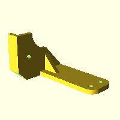

# Models

## 1_x_motor_mount (1_x_motor_mount.scad)

[OpenSCAD file](./src/1_x_motor_mount.scad) | [STL file](./distribution/1_x_motor_mount.stl)

## 2_x_carriage (2_x_carriage.scad)

[OpenSCAD file](./src/2_x_carriage.scad) | [STL file](./distribution/2_x_carriage.stl)

## 3_x_belt_end (3_x_belt_end.scad)

[OpenSCAD file](./src/3_x_belt_end.scad) | [STL file](./distribution/3_x_belt_end.stl)

## 4_x_carriage_belt_clamp (4_x_carriage_belt_clamp.scad)

[OpenSCAD file](./src/4_x_carriage_belt_clamp.scad) | [STL file](./distribution/4_x_carriage_belt_clamp.stl)

## 5_j_head_adapter (5_j_head_adapter.scad)

[OpenSCAD file](./src/5_j_head_adapter.scad) | [STL file](./distribution/5_j_head_adapter.stl)

## 6_extruder (6_extruder.scad)

[OpenSCAD file](./src/6_extruder.scad) | [STL file](./distribution/6_extruder.stl)

## 8_x_cable_guide (8_x_cable_guide.scad)

[OpenSCAD file](./src/8_x_cable_guide.scad) | [STL file](./distribution/8_x_cable_guide.stl)

## 9_z_endstop_holder (9_z_endstop_holder.scad)

[OpenSCAD file](./src/9_z_endstop_holder.scad) | [STL file](./distribution/9_z_endstop_holder.stl)

## EasyPanel-front (EasyPanel-front.scad)

[OpenSCAD file](./src/EasyPanel-front.scad) | [STL file](./distribution/EasyPanel-front.stl)

## EasyPanel-rear (EasyPanel-rear.scad)

[OpenSCAD file](./src/EasyPanel-rear.scad) | [STL file](./distribution/EasyPanel-rear.stl)

## Bed cutout (bed.scad)

[OpenSCAD file](./src/bed.scad) | [STL file](./distribution/bed.stl)

## pb_y_bar_end (pb_y_bar_end.scad)

[OpenSCAD file](./src/pb_y_bar_end.scad) | [STL file](./distribution/pb_y_bar_end.stl)

## pboardcase-base (pboardcase-base.scad)

[OpenSCAD file](./src/pboardcase-base.scad) | [STL file](./distribution/pboardcase-base.stl)

## pboardcase-lid (pboardcase-lid.scad)

[OpenSCAD file](./src/pboardcase-lid.scad) | [STL file](./distribution/pboardcase-lid.stl)
